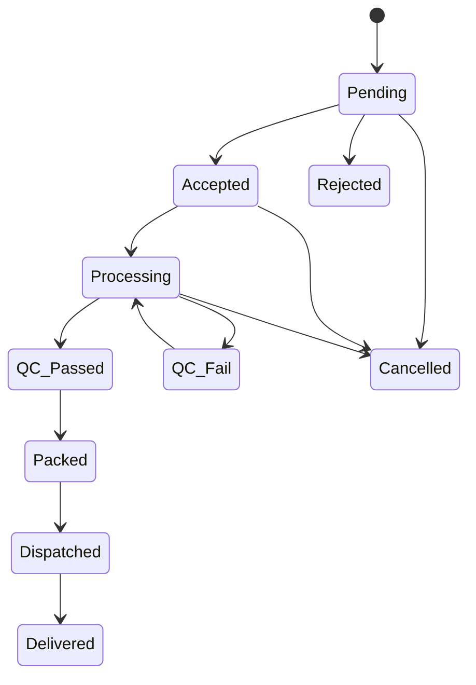

# Product Specification Document
## Spectacle Lens Supply Chain Management System

---

## Application Overview

**Industry**: Spectacle Lens Manufacturing & Distribution  
**Target Users**: Manufacturers, Distributors, Retailers, Sales Staff  
**Architecture**: Frontend-only with Firebase backend  
**Core Purpose**: Order management and sales lead management for spectacle lens supply chain

---

## Module 1: Order Management

### 1.1 Order Workflow

#### **Order Placement Process**
- **Initiator**: Retailers
- **Required Information**:
  - Prescription details
  - Lens specifications
  - Frame information
  - Customer details
  - Order metadata

#### **Approval Workflow**
```
Order Placed → Pending → Accept/Reject Decision
├── Accepted → Processing → QC → Packing → Dispatch → Delivery
└── Rejected → Order Closed (with reason)
```

#### **Order Modification Rules**
1. **Before Acceptance**: Retailer can modify freely without re-approval
2. **After Acceptance**: Any modification reverts order to "Pending" status
3. **Partial Acceptance**: Allowed at individual line-item level within order

#### **Cancellations & Returns**
- **Approval Required**: Must be approved by Distributor or Admin
- **Reason Tracking**: Optional comment field for audit trail
- **Status Change**: Order moves to "Cancelled" status

### 1.2 Order Status Flow



**Complete Status List**:
1. **Pending** - Awaiting approval from Distributor/Admin
2. **Accepted** - Order approved and ready for processing
3. **Rejected** - Order declined with reason
4. **Processing** - Order being manufactured/prepared
5. **QC Passed** - Quality control completed successfully
6. **QC Fail** - Quality control failed, requires rework
7. **Packed** - Order packed and ready for dispatch
8. **Dispatched** - Order shipped to customer
9. **Delivered** - Order successfully delivered
10. **Cancelled** - Order cancelled at any stage

### 1.3 Notification System

#### **Notification Channels**
- **Push Notifications**: Mobile/browser push
- **Web Portal Notification Bar**: In-app notification center

#### **Notification Content**
- Order ID
- End Customer Name
- Status-specific message

#### **Notification Templates**

| Status | Template |
|--------|----------|
| **Pending** | Order #[OrderID] for [CustomerName] has been placed and is pending approval from Distributor/Admin. |
| **Accepted** | Good news! Order #[OrderID] for [CustomerName] has been accepted and is being processed. |
| **Rejected** | Order #[OrderID] for [CustomerName] has been rejected. Reason: [RejectionReason]. Please contact support. |
| **Processing** | Order #[OrderID] for [CustomerName] is currently being processed. |
| **QC Passed** | Order #[OrderID] for [CustomerName] has passed quality checks and is being prepared for packing. |
| **QC Fail** | Order #[OrderID] for [CustomerName] did not pass quality checks. Action required. Please contact your distributor or company support. |
| **Packed** | Order #[OrderID] for [CustomerName] has been packed and is ready for dispatch. |
| **Dispatched** | Order #[OrderID] for [CustomerName] has been dispatched. Delivery will follow soon. |
| **Delivered** | Order #[OrderID] for [CustomerName] has been successfully delivered. |
| **Cancelled** | Order #[OrderID] for [CustomerName] has been cancelled. Reason: [CancellationReason]. For queries contact support. |

---

## Module 2: Sales Staff Lead Management

### 2.1 Lead Capture

#### **Required Lead Information**
- **Optician Name**: Business name
- **Contact Person Name**: Key contact person
- **Phone Number**: Primary contact
- **Email Address**: Business email
- **Address**: Complete business address
- **GST Number**: Tax identification
- **Week Off**: Business closure day

### 2.2 Visit Scheduling & Geo-tagging

#### **Visit Management**
- **Schedule Visits**: Plan visits in advance
- **Reschedule**: Modify existing visit schedules
- **Cancel**: Cancel scheduled visits

#### **Geo-tagging Requirements**
- **Mandatory**: Required at check-in and check-out
- **Precision**: 10-meter radius accuracy
- **Purpose**: Verify actual visit completion

#### **Data Capture During Visits**
- **Visit Notes**: Text-based visit summary
- **Photos**: Visual documentation
- **Follow-up Tasks**: Action items for next steps

### 2.3 Lead Onboarding Process

#### **Onboarding Workflow**
```
Lead Qualification → Sales Staff Initiates Onboarding → Immediate Activation
```

#### **Onboarding Features**
- **Initiator**: Sales Staff only
- **Activation**: Immediate without additional approval
- **Account Type**: Tagged as Distributor or Direct account
- **Credentials**: User ID sent via SMS
- **Document Uploads** (Optional):
  - Business License
  - GST Certificate
  - Store Photos

### 2.4 Performance Tracking

#### **Individual Dashboards**
- **Target Audience**: Sales Staff
- **Metrics Displayed**: Personal KPIs and achievements

#### **Aggregate Reports**
- **Target Audience**: Managers and Admins
- **Content**: Team performance and trends

#### **Key Performance Indicators (KPIs)**
- **Visits Conducted**: Total visits completed
- **Leads Generated**: New leads captured
- **Leads Converted**: Successful onboarding rate
- **Sales Achieved**: Revenue generated from converted leads

---

## Module 3: Notification System (Detailed)

### 3.1 Event Triggers
- **Primary**: Order status changes
- **Secondary**: System alerts, account updates

### 3.2 Notification Channels
1. **Push Notifications**: Real-time mobile/browser alerts
2. **Web Portal Notification Bar**: In-app notification center

### 3.3 Notification Content Structure
```json
{
  "orderId": "ORD123456",
  "customerName": "John Doe",
  "status": "Accepted",
  "message": "Template-based message",
  "timestamp": "2024-01-15T10:30:00Z",
  "actionRequired": false
}
```

### 3.4 User Preferences
- **Default**: Push notifications enabled
- **Customization**: Users can manage notification preferences
- **Web Bar**: Always visible for logged-in users

---

## User Flows

### Flow 1: Complete Order Management

```
1. Retailer Login → Dashboard
2. Create New Order → Enter Details (Prescription, Lens, Frame, Customer)
3. Submit Order → Status: Pending
4. Distributor/Admin Reviews → Accept/Reject Decision
5A. If Accepted → Processing → QC → Packed → Dispatched → Delivered
5B. If Rejected → Order Closed (Reason Provided)
6. Notifications sent at each status change
7. Retailer can track order progress in real-time
```

### Flow 2: Order Modification Scenarios

```
Scenario A - Before Acceptance:
1. Order in Pending status
2. Retailer clicks "Modify Order"
3. Makes changes → Saves
4. Order remains in Pending (no re-approval needed)

Scenario B - After Acceptance:
1. Order in Processing/QC/Packed status
2. Retailer requests modification
3. Order reverts to Pending status
4. Requires fresh Distributor/Admin approval
```

### Flow 3: Sales Staff Lead Management

```
1. Sales Staff Login → Lead Dashboard
2. Add New Lead → Fill required fields
3. Schedule Visit → Set date/time with geo-location
4. Conduct Visit → Check-in (geo-tag) → Capture notes/photos → Check-out (geo-tag)
5. Qualify Lead → Initiate Onboarding
6. Lead Activated → Credentials sent via SMS
7. New Retailer can immediately place orders
8. Performance metrics updated automatically
```

### Flow 4: Notification Flow

```
1. Order Status Changes → System Event Triggered
2. Generate Notification → Apply Template
3. Send Push Notification → User Mobile/Browser
4. Update Web Portal Notification Bar
5. User Reads Notification → Mark as Read
6. Optional: User Takes Action (if required)
```

---

## Technical Considerations

### Firebase Integration Points

#### **Collections Structure**
```
/companies/{companyId}
  /orders/{orderId}
    - status, customer, prescription, timeline
  /leads/{leadId}
    - contact details, visit history, conversion status
  /users/{userId}
    - profile, role, territory assignments
  /notifications/{notificationId}
    - content, status, recipient, timestamp
```

#### **Real-time Features**
- Order status updates
- New lead assignments
- Notification delivery
- Performance dashboard updates

#### **Security Rules**
- Role-based data access
- Territory-based filtering
- User-specific notifications

---

## Success Metrics

### Order Management
- **Order Processing Time**: Average time from pending to delivered
- **Order Accuracy**: Percentage of orders completed without modifications
- **Customer Satisfaction**: Based on delivery performance

### Lead Management
- **Conversion Rate**: Leads to active retailers ratio
- **Visit Efficiency**: Successful visits per sales staff
- **Onboarding Speed**: Time from lead to active retailer

### System Performance
- **User Adoption**: Active users percentage
- **Notification Engagement**: Read/action rates
- **System Uptime**: Availability metrics

---

*This specification serves as the foundation for developing the Spectacle Lens Supply Chain Management System with order management and lead management capabilities.*